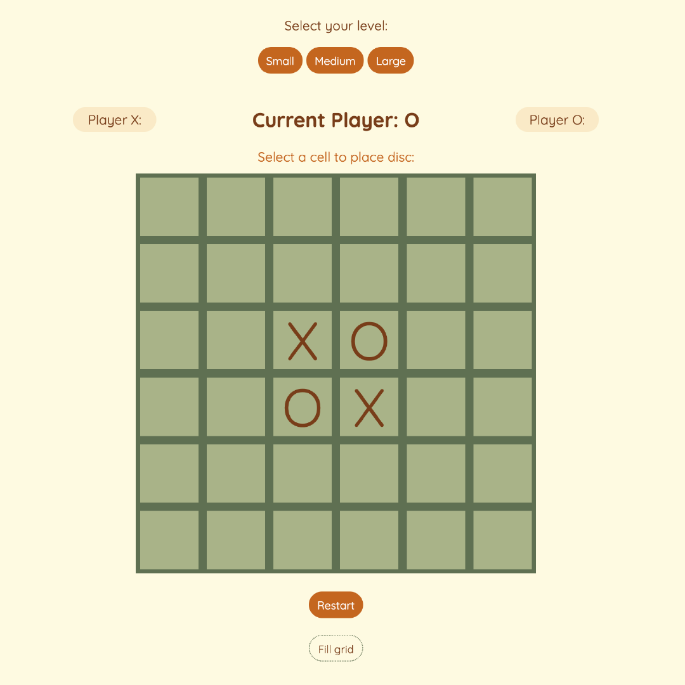
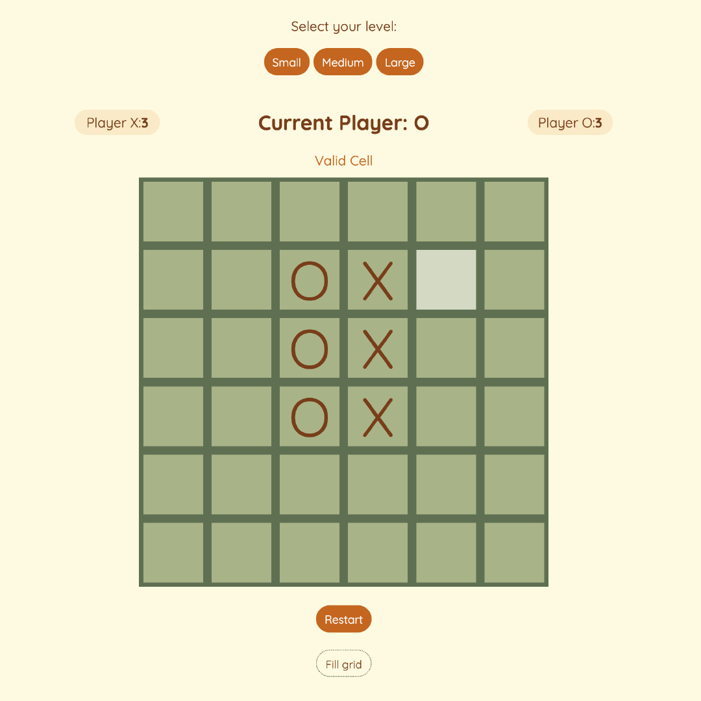
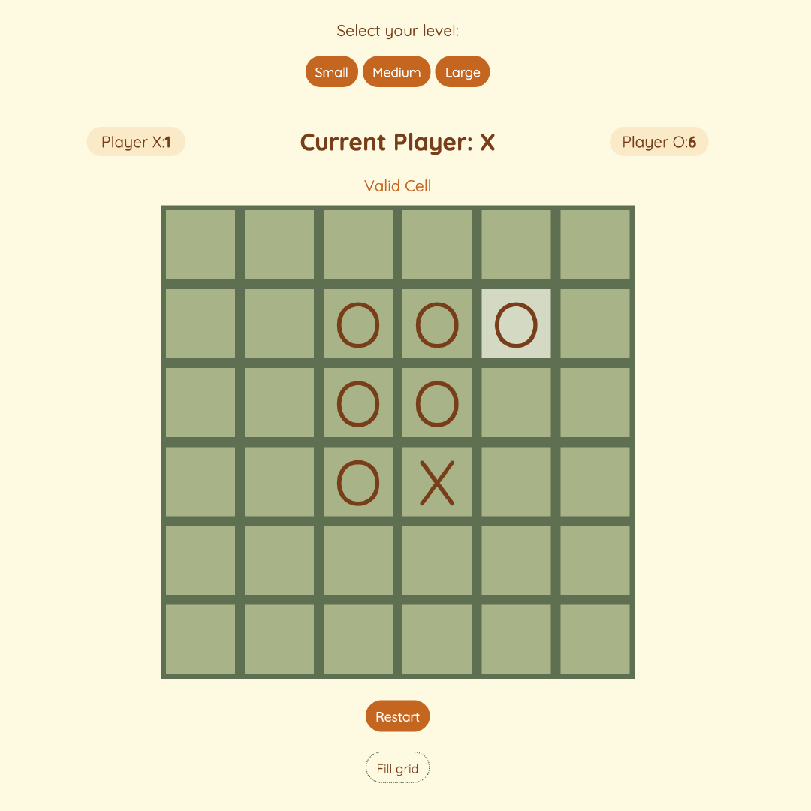
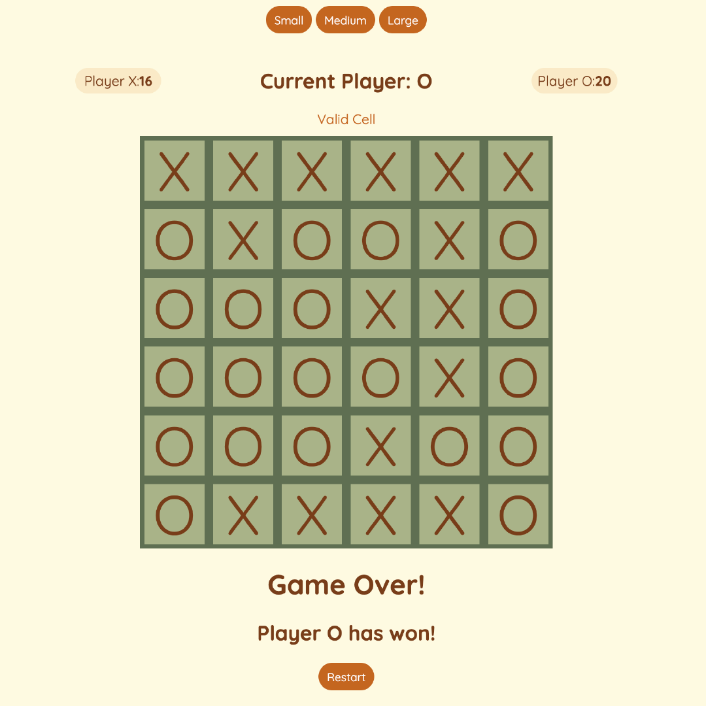

# Reversi

Reversi is a two-player game on a 8 x 8 board. Each player is represented a coloured disc - black or white. The objective is to have the most number of discs of your colour at the end of the game.

The game begins from the center of the grid with 2 discs representing each player. Player 1 (e.g. black) places his disc on an empty cell adjacent to discs of Player 2 (e.g. white), and all the discs of Player 2 (white) situated between the newly placed disc and will have their colour reversed to Player 1's colour (black).

### Rules

- Disc can only be placed on an empty cell adjacent to cell occupied by opponent's disc.
- Disc at the end of a chain of opponent discs (in any of the 8 directions - horizontal, vertical, diagonals) has to be player's disc.
- Opponent's discs along the chain of the newly-placed disc and player's disc at the endf of chain will be flipped to player's discs.
- Game ends when there are not valid cells or when all the cells of the grid are occupied.
- The objective is get the most number of discs at the end of the game to win.

## Coding the game

### Languages

Javascript, CSS, HTML

### Logic

1.  Set up a matrix of IDs to represent the individual cells of the grid (divs) - function matrixOfIds, tagCellsWithId
2.  Select center cells which are occupied by discs of opposing players. - function centerIds

3.  Invalid cells:
    - are not empty
    - have directly adjacent cells are all empty - function allAdjCellsEmpty
4.  Valid cells - valid cells are highlighted when mouseover
    - have adjacent cells that contain disc of opposing player - function checkAdjCells
    - have the current player's disc situated at the end of chain of opponent cells

5.  Opponent discs sandwiched between end of chain and newly-placed disc are flipped to current player's.

6.  Switch player until no more valid moves or when all the cells in the grid are occupied.
7.  Player with the most number of discs wins, otherwise, it's a tie.

### Live URL

https://othello-three.vercel.app/

### Next Steps

- Implement Game Over even when grid is not filled
- Change the grid size when players press on small, medium, large
- Replace discs with images of cats
